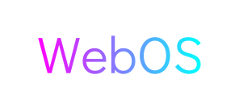

<!-- Improved compatibility of back to top link: See: https://github.com/othneildrew/Best-README-Template/pull/73 -->
<a name="readme-top"></a>
<!--
*** Thanks for checking out the Best-README-Template. If you have a suggestion
*** that would make this better, please fork the repo and create a pull request
*** or simply open an issue with the tag "enhancement".
*** Don't forget to give the project a star!
*** Thanks again! Now go create something AMAZING! :D
-->


<!-- PROJECT SHIELDS -->
<!--
*** I'm using markdown "reference style" links for readability.
*** Reference links are enclosed in brackets [ ] instead of parentheses ( ).
*** See the bottom of this document for the declaration of the reference variables
*** for contributors-url, forks-url, etc. This is an optional, concise syntax you may use.
*** https://www.markdownguide.org/basic-syntax/#reference-style-links
-->
[![Contributors][contributors-shield]][contributors-url]
[![Forks][forks-shield]][forks-url]
[![Stargazers][stars-shield]][stars-url]
[![Issues][issues-shield]][issues-url]
[![MIT License][license-shield]][license-url]
[![LinkedIn][linkedin-shield]][linkedin-url]


<!-- PROJECT LOGO -->
<br />
<div align="center">
  <a href="https://github.com/mind-matrix/webos">
    
  </a>

  <h3 align="center">
    Probably The Web's First Single-Threaded OS
  </h3>

  <p align="center">
    To Make The World A Better Place 😌
    <br />
    <a href="https://github.com/mind-matrix/webos"><strong>Explore the docs »</strong></a>
    <br />
    <br />
    <a href="https://mind-matrix.github.io/webos">View Demo</a>
    ·
    <a href="https://github.com/mind-matrix/webos/issues">Report Bug</a>
    ·
    <a href="https://github.com/mind-matrix/webos/issues">Request Feature</a>
  </p>
</div>


<!-- TABLE OF CONTENTS -->
<details>
  <summary>Table of Contents</summary>
  <ol>
    <li>
      <a href="#about-the-project">About The Project</a>
      <ul>
        <li><a href="#built-with">Built With</a></li>
      </ul>
    </li>
    <li>
      <a href="#getting-started">Getting Started</a>
      <ul>
        <li><a href="#prerequisites">Prerequisites</a></li>
        <li><a href="#installation">Installation</a></li>
      </ul>
    </li>
    <li><a href="#usage">Usage</a></li>
    <li><a href="#roadmap">Roadmap</a></li>
    <li><a href="#contributing">Contributing</a></li>
    <li><a href="#license">License</a></li>
    <li><a href="#contact">Contact</a></li>
    <li><a href="#acknowledgments">Acknowledgments</a></li>
  </ol>
</details>


<!-- ABOUT THE PROJECT -->
## About The Project

[![Product Name Screen Shot][product-screenshot]](https://mind-matrix.github.io/webos)

**TL;DR** Tried to create an OS entirely in Typescript for fun. 😄

**For The Gentlemen:** Creating a Platform of any capacity entirely in TypeScript is a challenging task since it requires acknowledgement of necessary features that are usually best implemented at a very low level - such as memory management, process management, etc. - and demand redesign for implementation at such a high level; not to mention the problem of providing concurrency to programs in a single-threaded environment and also the fact that a Web Page does not necessarily have access to all features of the hardware that a traditional program does.

The primary aim for the Platform is to meet the following requirements -

1. Be a sufficiently (subjectively evaluated) featured - if not fully capable - platform with a -
    *  User Interface
    * Process Management System
    * Event System
2. Have low latency and idle state processing overhead.
3. Be highly customizable -
    * Can add External Programs
    * Can update existing Programs
    * Has IPC (Inter-Process Communication) mechanisms

<p align="right">(<a href="#readme-top">back to top</a>)</p>


### Built With

This section lists major technologies, frameworks and/or libraries used to bootstrap the project.

* [![TypeScript][Typescriptlang.org]][Typescript-url]
* [![Webpack][Webpack.js.org]][Webpack-url]
* [![HTML][Html.org]][Html-url]
* [![Sass][Sass-lang.com]][Sass-url]

<p align="right">(<a href="#readme-top">back to top</a>)</p>


<!-- GETTING STARTED -->
## Getting Started

To get your own WebOS running on your local browser -

### Prerequisites

The following requirements are necessary for WebOS to work
* node >= 16.18.1 (check version)
  ```sh
  node -v
  ```
* npm
  ```sh
  npm install npm@latest -g
  ```

### Installation

2. Clone the repo
   ```sh
   git clone https://github.com/mind-matrix/webos.git
   ```
3. Install NPM packages
   ```sh
   npm install
   ```
4. Start the development server
   ```sh
   npm run start
   ```

<p align="right">(<a href="#readme-top">back to top</a>)</p>


<!-- USAGE EXAMPLES -->
<!-- ## Usage

Use this space to show useful examples of how a project can be used. Additional screenshots, code examples and demos work well in this space. You may also link to more resources.

_For more examples, please refer to the [Documentation](https://example.com)_

<p align="right">(<a href="#readme-top">back to top</a>)</p> -->


<!-- ROADMAP -->
## Roadmap

Working on it 🔧
<!-- - [ ] Create Roadmap Section -->

See the [open issues](https://github.com/mind-matrix/webos/issues) for a full list of proposed features (and known issues).

<p align="right">(<a href="#readme-top">back to top</a>)</p>


<!-- CONTRIBUTING -->
## Contributing

Contributions are what make the open source community such an amazing place to learn, inspire, and create. Any contributions you make are **greatly appreciated**.

If you have a suggestion that would make this better, please fork the repo and create a pull request. You can also simply open an issue with the tag "enhancement".
Don't forget to give the project a star! Thanks again!

1. Fork the Project
2. Create your Feature Branch (`git checkout -b feature/AmazingFeature`)
3. Commit your Changes (`git commit -m 'Add some AmazingFeature'`)
4. Push to the Branch (`git push origin feature/AmazingFeature`)
5. Open a Pull Request

<p align="right">(<a href="#readme-top">back to top</a>)</p>


<!-- LICENSE -->
## License

Distributed under the MIT License. See `LICENSE.txt` for more information.

<p align="right">(<a href="#readme-top">back to top</a>)</p>


<!-- CONTACT -->
## Contact

Sagnik Modak - [@sagnikmodak1118](https://medium.com/@sagnikmodak1118) - sagnikmodak1118@gmail.com

Project Link: [https://github.com/mind-matrix/webos](https://github.com/mind-matrix/webos)

<p align="right">(<a href="#readme-top">back to top</a>)</p>


<!-- ACKNOWLEDGMENTS -->
<!-- ## Acknowledgments

Use this space to list resources you find helpful and would like to give credit to. I've included a few of my favorites to kick things off!

* [Choose an Open Source License](https://choosealicense.com)
* [GitHub Emoji Cheat Sheet](https://www.webpagefx.com/tools/emoji-cheat-sheet)
* [Malven's Flexbox Cheatsheet](https://flexbox.malven.co/)
* [Malven's Grid Cheatsheet](https://grid.malven.co/)
* [Img Shields](https://shields.io)
* [GitHub Pages](https://pages.github.com)
* [Font Awesome](https://fontawesome.com)
* [React Icons](https://react-icons.github.io/react-icons/search)

<p align="right">(<a href="#readme-top">back to top</a>)</p> -->


<!-- MARKDOWN LINKS & IMAGES -->
<!-- https://www.markdownguide.org/basic-syntax/#reference-style-links -->
[contributors-shield]: https://img.shields.io/github/contributors/mind-matrix/webos.svg?style=for-the-badge
[contributors-url]: https://github.com/mind-matrix/webos/graphs/contributors
[forks-shield]: https://img.shields.io/github/forks/mind-matrix/webos.svg?style=for-the-badge
[forks-url]: https://github.com/mind-matrix/webos/network/members
[stars-shield]: https://img.shields.io/github/stars/mind-matrix/webos.svg?style=for-the-badge
[stars-url]: https://github.com/mind-matrix/webos/stargazers
[issues-shield]: https://img.shields.io/github/issues/mind-matrix/webos.svg?style=for-the-badge
[issues-url]: https://github.com/mind-matrix/webos/issues
[license-shield]: https://img.shields.io/github/license/mind-matrix/webos.svg?style=for-the-badge
[license-url]: https://github.com/mind-matrix/webos/blob/master/LICENSE.txt
[linkedin-shield]: https://img.shields.io/badge/-LinkedIn-black.svg?style=for-the-badge&logo=linkedin&colorB=555
[linkedin-url]: https://linkedin.com/in/sagnik-modak
[product-screenshot]: images/screenshot.png
[Typescriptlang.org]: https://img.shields.io/badge/Typescript-35495E?style=for-the-badge&logo=typescript
[Typescript-url]: https://www.typescriptlang.org/
[Webpack.js.org]: https://img.shields.io/badge/Webpack-20232A?style=for-the-badge&logo=webpack
[Webpack-url]: https://webpack.js.org/
[Sass-lang.com]: https://img.shields.io/badge/Sass-4A4A55?style=for-the-badge&logo=sass
[Sass-url]: https://sass-lang.com/
[Html.org]: https://img.shields.io/badge/HTML-4A4A55?style=for-the-badge&logo=html5
[Html-url]: https://html.spec.whatwg.org/multipage/